+++
title = 'The Dark Side of Vimeo: video meta-data contains PowerShell script and leads to host compromise'
date = 2023-10-10T22:03:53+02:00
draft = false
+++

During my daily blue-team operations I stumbled across a series of similar infection chains, all started with an infected thumb drive. Since the installed security solution detected with a generic signature the threat but didn't block it, I took charge of the alerts and decided to deep dive and analyze the sample. What I've discovered, with the help of my colleagues, is a worm which uses the streaming platform Vimeo to host its payload.

The initial access vector it's an infected USB stick, used to transfer files to a copy shop, containing the following files:

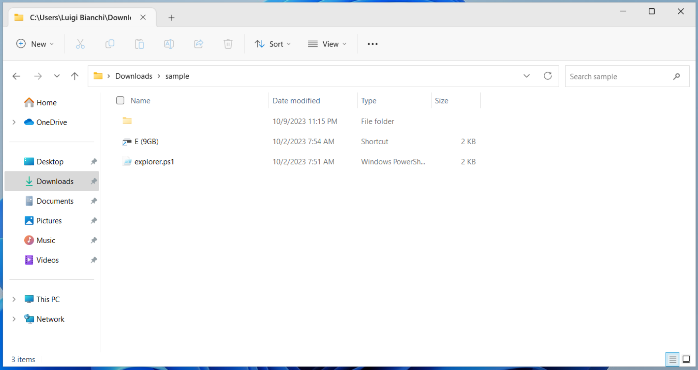

- `E (9GB).lnk` it's a shortcut file
- `explorer.ps1` it's a PowerShell script, hidden
- `ㅤ` (`U+3164`) it's an empty folder, hidden

Opening `E (9GB).lnk`'s "Properties" window reveals what seems obvious: the execution target is `explorer.ps1`. What seems odd it's that E: is not the mount point of the thumb drive on the victim machine; a good guess is that E: it's (or better, was) the mount point of the thumb drive on the infected machine, presumably a computer at the copy shop.

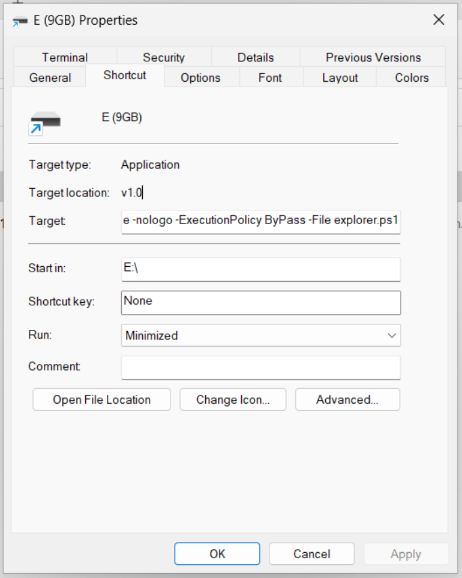

Let's take a look at the PowerShell script:

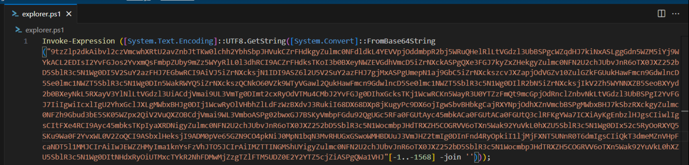

which, using CyberChef or similar tools, can be easily deobfuscated by extracting, reversing, joining and converting the string passed as argument to `FromBase64String` function:

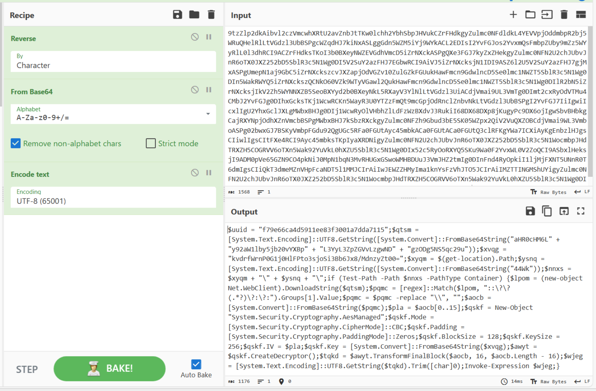

which leads to a first stage PowerShell script that, for the sake of simplicity, I've already deobfuscated:

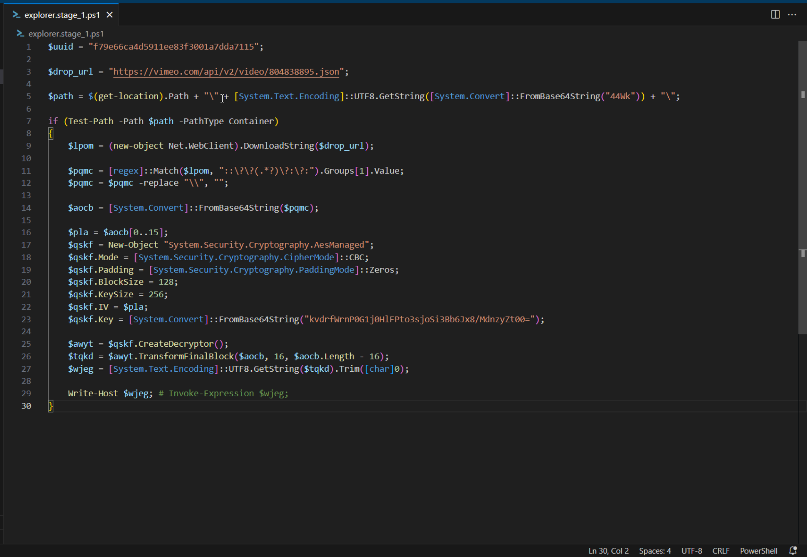

Reading trought the code reveals some interesting facts:

- the script makes a web request to Vimeo's streaming services, searching for a specific video meta-data; the response is extracted with a regular expression and decrypted using AES with the initialization vector and the symmetic key are hard-coded into the script; the whole process undergoes an additional stage.

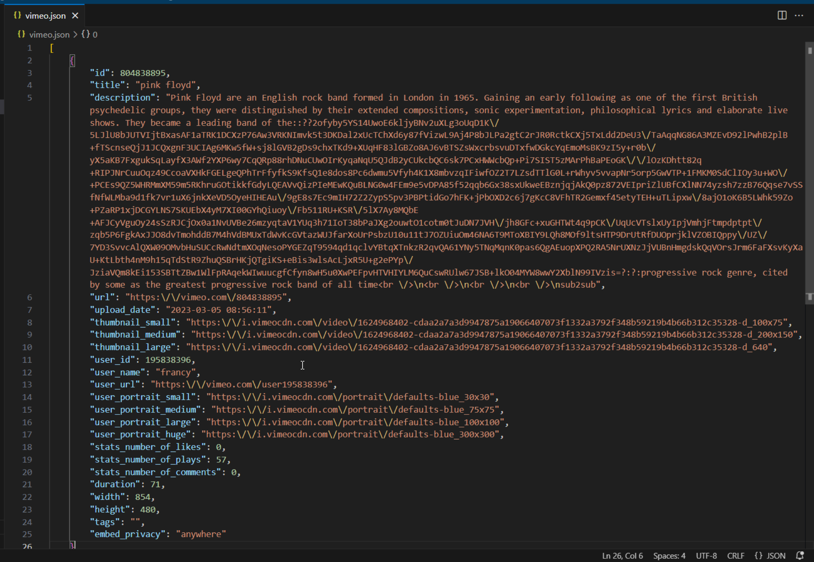

- `44Wk` is the Base64 encoding of `ㅤ` (`U+3164`) which is exactly the name of the blank and hidden folder on the USB stick; in fact, the folder presence in pair with the command `Test-Path` is used to prevent the script from executing if the folder do not exists; a clever anti-sandbox tecnique

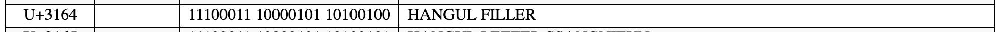

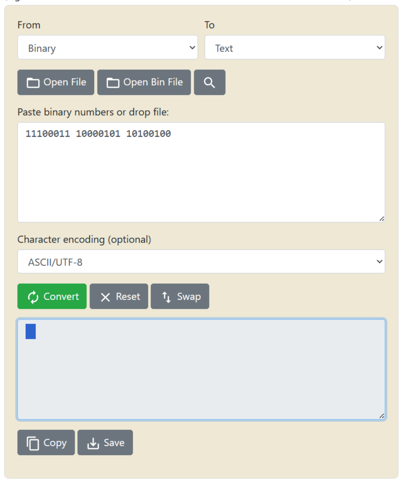

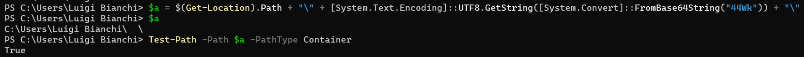

To review the second stage, I simply printed it instead of running it.

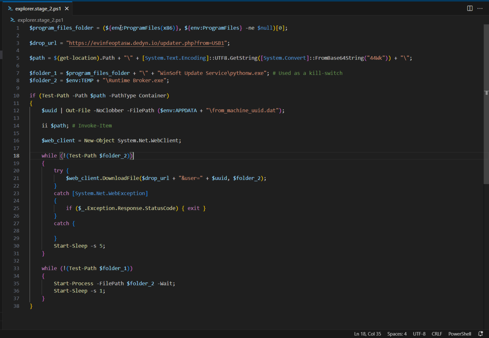

Some findings:

- the folder trick is used again
- the `$uuid` variable is written to a file on disk
- the `$uuid` variable is appended to the drop url and a web request is made; the response is written to a file named `Runtime Broker.exe` and saved into the user temporary folder, then the script waits for five seconds
- if `%PROGRAMFILES%\WinSoft Update Service\pythonw.exe` exists the script terminates immediately, otherwise the script waits for one second then `Runtime Broker.exe` is launched; this could be a kill switch implemented by the attacker during development in order to avoid auto-infection

At the time of analysis, I was unable to download the file but fortunately I managed to retrieve it from the security solution.

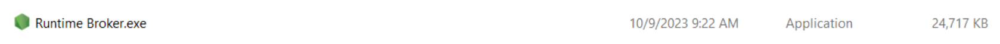

Analyzing the PE meta-data, specifically the description and icon, it's clear that the malware is trying to masquerade as Node.JS, an engine used to execute JavaScript code server-side.

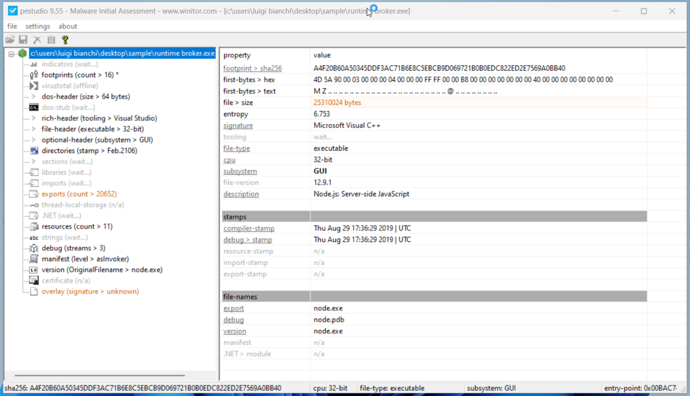

Detonating the file with [VirusTotal](https://www.virustotal.com/gui/file/a4f20b60a50345ddf3ac71b6e8c5ebcb9d069721b0b0edc822ed2e7569a0bb40) and [Hybrid Analysis](https://www.hybrid-analysis.com/sample/a4f20b60a50345ddf3ac71b6e8c5ebcb9d069721b0b0edc822ed2e7569a0bb40) did not lead to great discoveries but from threat intelligence sources the sample could be a variant of TurkoRAT, an open source infostealer.

# IOCs

Available [here](iocs.csv).