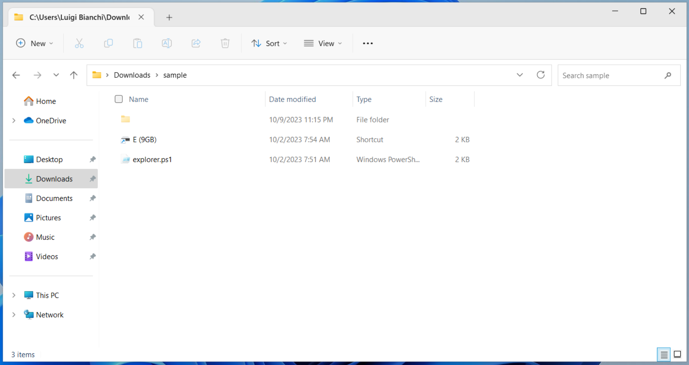
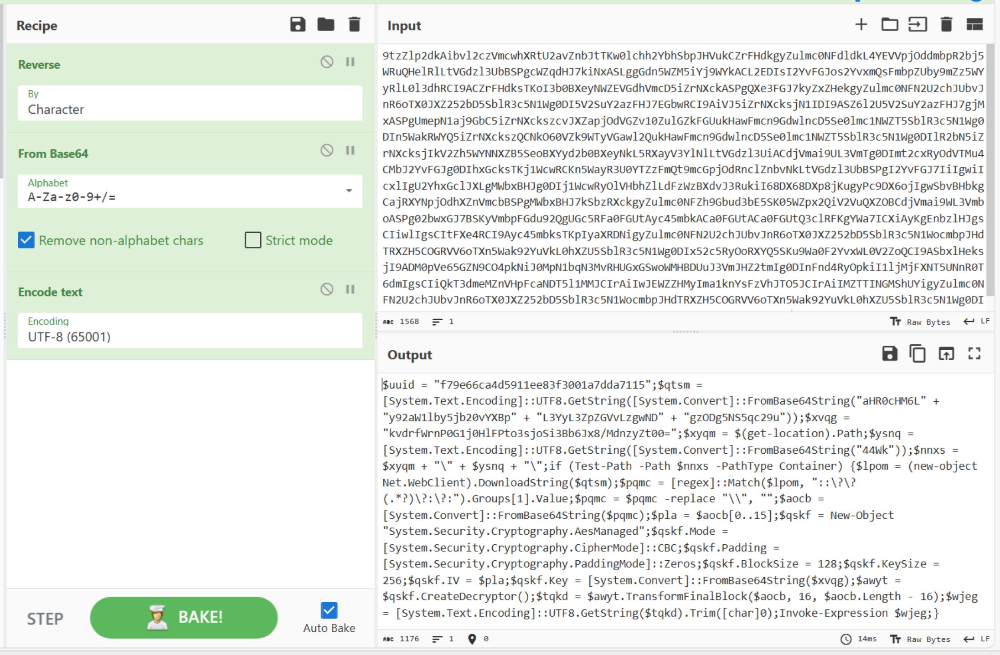
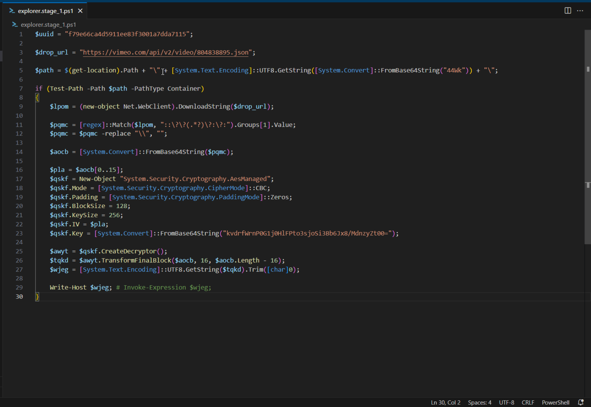
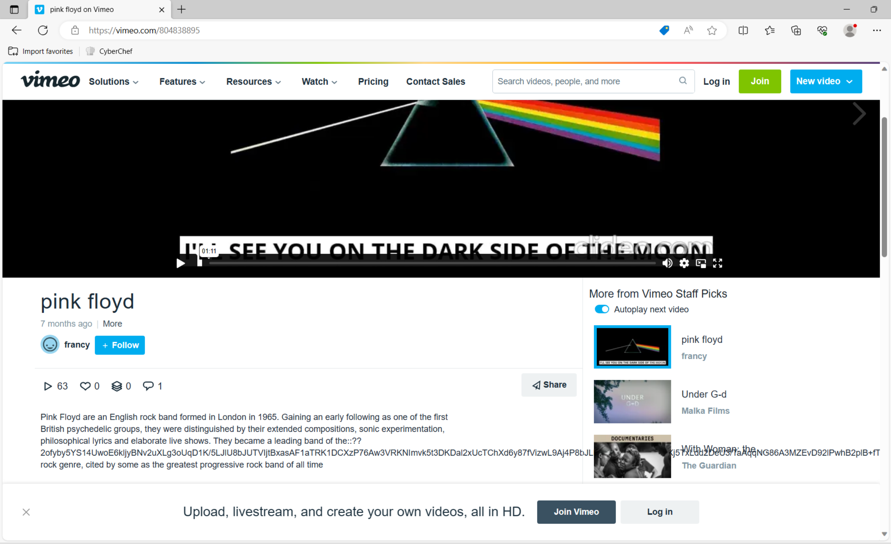
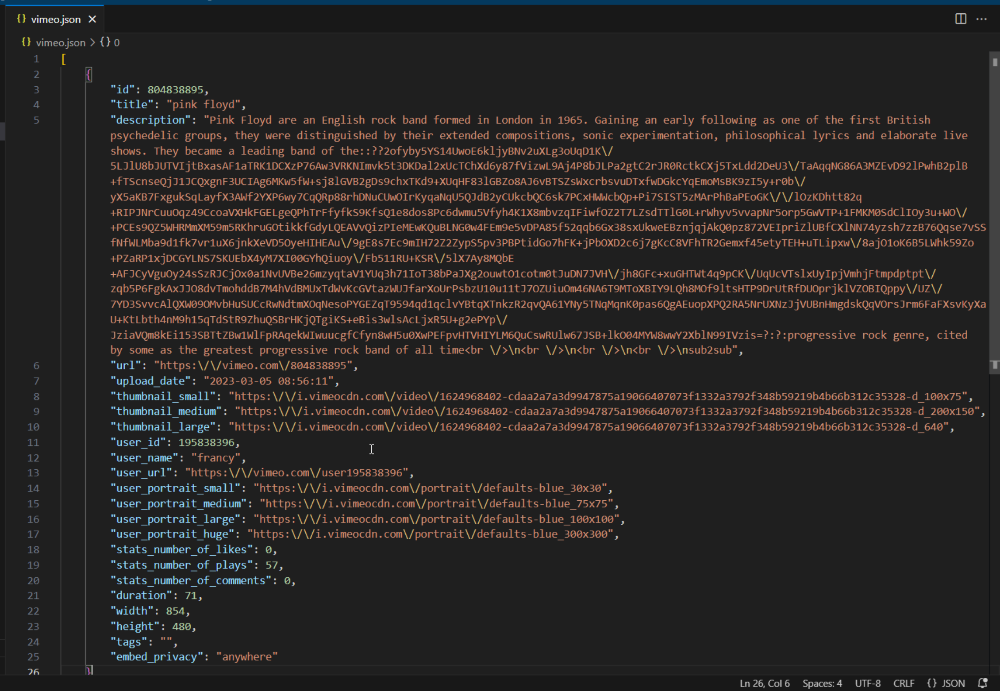
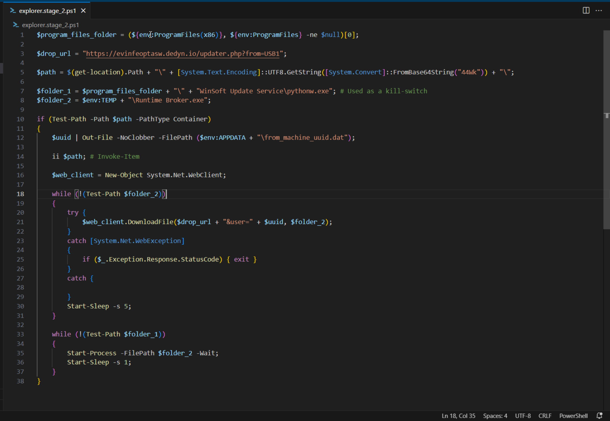

+++
title = 'The Dark Side of Vimeo: video meta-data contains PowerShell script and leads to host compromise'
date = 2023-10-10T22:03:53+02:00
draft = false
+++

# Introduction

During my daily blue-team operations I stumbled across a series of similar infection chains, all started with an infected thumb drive. Since the installed security solution detected with a generic signature the threat but didn't block it, I took charge of the alerts and decided to deep dive and analyze the sample.

# Analysis

The initial access vector it's an infected USB stick, used to transfer files to a copy shop, containing the following files:

- `E (9GB).lnk` it's a shortcut file
- `explorer.ps1` it's a PowerShell script, hidden
- `ㅤ` (`U+3164`) it's an empty folder, hidden

Opening `E (9GB).lnk`'s "Properties" window reveals what seems obvious: the execution target is `explorer.ps1`. What seems odd it's that E: is not the mount point of the thumb drive on the victim machine; a good guess is that E: it's (or better, was) the mount point of the thumb drive on the infected machine, presumably a computer at the copy shop.

Let's take a look at the PowerShell script:

which, using CyberChef or similar tools, can be easily deobfuscated by extracting, reversing, joining and converting the string passed as argument to `FromBase64String` function:

which leads to a first stage PowerShell script that, for the sake of simplicity, I've already deobfuscated:

Reading trought the code reveals some interesting facts:

- the script makes a web request to Vimeo's streaming services, searching for a specific video meta-data; the response is extracted with a regular expression and decrypted using AES with the initialization vector and the symmetic key hard-coded into the script; the whole process undergoes an additional stage

- `44Wk` is the Base64 encoding of `ㅤ` (`U+3164`) which is exactly the name of the blank and hidden folder on the USB stick; in fact, the folder presence in pair with the command `Test-Path` is used to prevent the script from executing if the folder do not exists; a clever anti-sandbox technique

[Hangul](https://en.wikipedia.org/wiki/Hangul) is the modern official writing system for the Korean language.

To review the second stage, I simply printed it instead of running it.

Some findings:

- the folder trick is used again
- the `$uuid` variable is written to a file on disk
- the `$uuid` variable is appended to the drop url and a web request is made; the response is written to a file named `Runtime Broker.exe` and saved into the user temporary folder, then the script waits for five seconds
- if `%PROGRAMFILES%\WinSoft Update Service\pythonw.exe` exists the script terminates immediately, otherwise the script waits for one second then launches `Runtime Broker.exe`; this could be a kill switch implemented by the attacker during development in order to avoid auto-infection

At the time of analysis, I was unable to download the file but fortunately I managed to retrieve it from the security solution.

Analyzing the PE meta-data, specifically the description and icon, it's clear that the malware is trying to masquerade as Node.JS, an engine used to execute JavaScript code server-side.

Detonating the file with [VirusTotal](https://www.virustotal.com/gui/file/a4f20b60a50345ddf3ac71b6e8c5ebcb9d069721b0b0edc822ed2e7569a0bb40), [Tria.ge](https://tria.ge/231011-hrrjwsae49) and [Hybrid Analysis](https://www.hybrid-analysis.com/sample/a4f20b60a50345ddf3ac71b6e8c5ebcb9d069721b0b0edc822ed2e7569a0bb40) did not lead to great discoveries but from threat intelligence sources the sample could be a variant of the open source infostealer TurkoRAT.

# Conclusion

As removable drives remain popular amoung users as an easy way to share files with colleagues and suppliers, attackers will continue to use them as infection vectors, using novel techniques to trick users into clicking on stuff.

# IOCs

Available [here](iocs.csv).