+++
title = "DIY Rubber Ducky clone with a DigiSpark ATTiny85, 2K24 revamp"
date = 2024-04-13T14:38:32+02:00
draft = false
categories = ["Red Team"]
tags = ["Rubber Ducky"]
+++

DigiSpark ATTiny85 is a compact AVR-based architecture micro-controller, available for a few bucks on [Amazon](https://www.amazon.com/WWZMDiB-Digispark-Kickstarter-Development-Compatible/dp/B0BVY36P13/), which can be programmed to simulate an input device, such as a keyboard, making an interesting alternative to [Hak5's rubber ducky](https://shop.hak5.org/products/usb-rubber-ducky). Unfortunately, the board's vendor discontinued support a few years ago and the [official site](http://digistump.com/package_digistump_index.json) hosting the configuration package is still offline, making the manual installation the only way to setup the board. Over the years some projects, such as Spence Konde's [ATTinyCore](https://github.com/SpenceKonde/ATTinyCore), tried to fill the void but installation of additional libraries is still required.

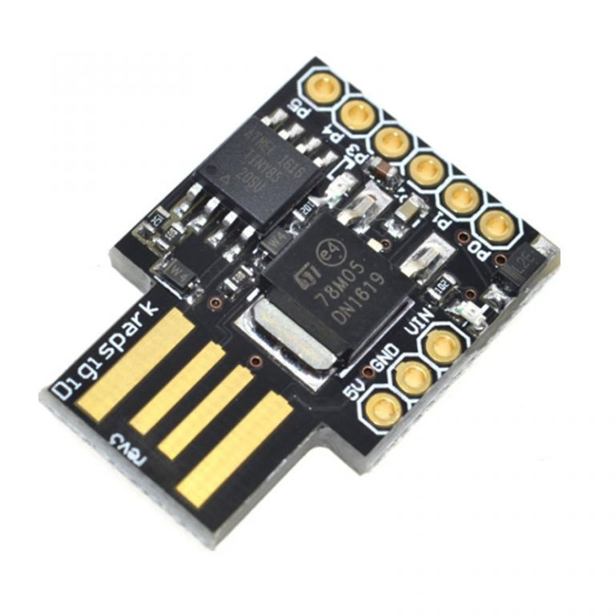

# Installation

- go to [DigiStump's repository](https://github.com/digistump/DigistumpArduino) under the "Releases" tab and download the `digistump-avr-1.6.7.zip` file then navigate to the `tools` folder and download the pre-compiled bundle that matches your operating system. Just an advice: clone the entire GitHub repository and saving it locally, you never know how long it will be available...


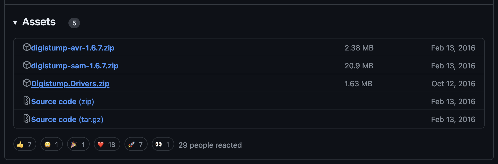
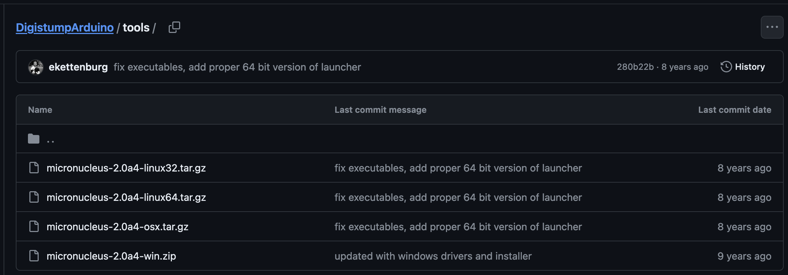

- if you're on Windows, also download the `DigiStump.Drivers.zip` file, extract the archive's content and execute `Install Drivers.exe` with administrative privileges

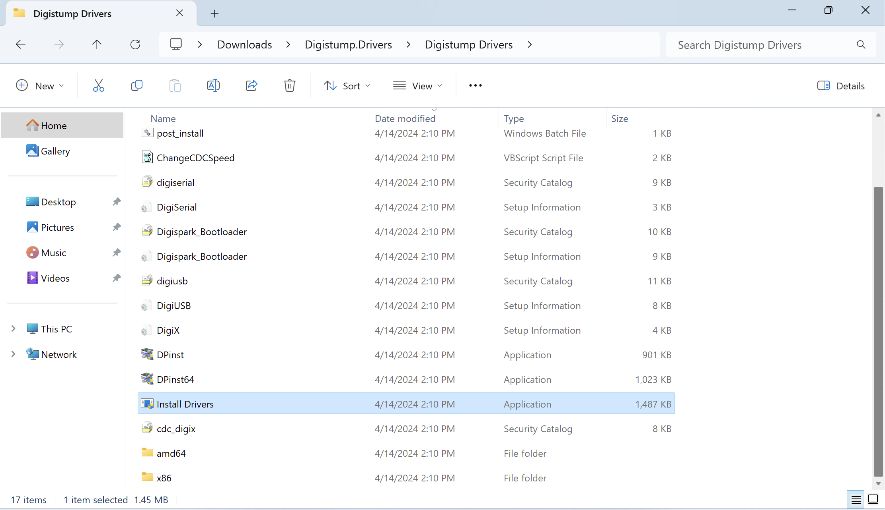
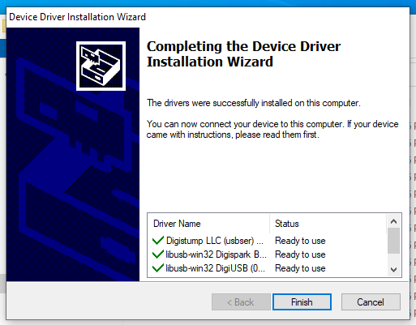

- go to [Arduino's website](https://www.arduino.cc/en/software), download and install the Arduino integrated development environment. If you're installing the software on a non-standard directory, annotate it, you'll need it in the next steps. The default installation path is:
  - `%UserProfile%\AppData\Local\Arduino15` on Windows
  - `/Users/<USER>/Library/Arduino15` on Mac

- into the mentioned installation path, under the `packages` directory, reproduce the following folders structure:
  - `digistump\hardware\avr\1.6.7`
  - `digistump\tools\micronucleus\2.6`

- inside the first, extract and copy the content of `digistump-avr-1.6.7.zip`
- inside the second, extract and copy the content of `micronucleus-2.0a4-<ARCH>.zip`

- to verify that the procedure was successful, open Arduino and, in the Boards Manager section, you should see _DigiStump AVR Boards_ installed

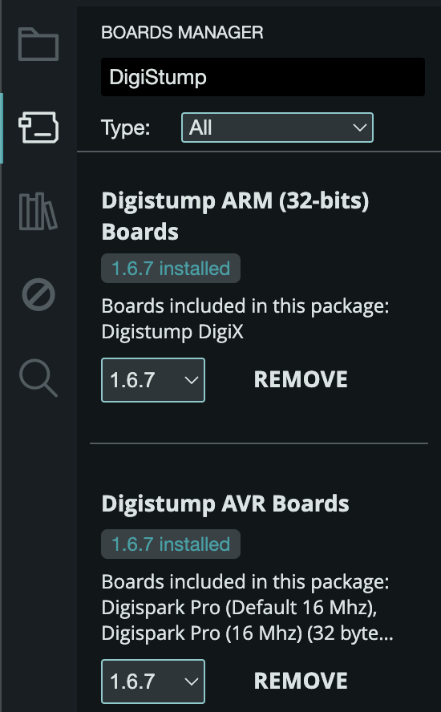

# First Sketch

- click on *File > New Sketch* and copy-paste the following code. For the sake of simplicity, in this guide I will use a very basic script that, without user interaction, opens a notepad and writes a short sentence. However, it's possible to find more sophisticated scripts, suitable for red team purposes, in this [repository](https://github.com/CedArctic/DigiSpark-Scripts)

```c
#include "DigiKeyboard.h"

void setup() {

}

void loop() {
  DigiKeyboard.sendKeyStroke(0);
  DigiKeyboard.delay(500);

  DigiKeyboard.sendKeyStroke(KEY_R, MOD_GUI_LEFT);
  DigiKeyboard.delay(500);

  DigiKeyboard.print("notepad");
  DigiKeyboard.sendKeyStroke(KEY_ENTER);
  DigiKeyboard.delay(500);

  DigiKeyboard.print("Hello World!");

  for (;;) {

  }
}
```

- go to *Tools > Boards* and select *Digistump AVR Boards > Digispark (Default - 16.5 mhz)* from the drop-down menu

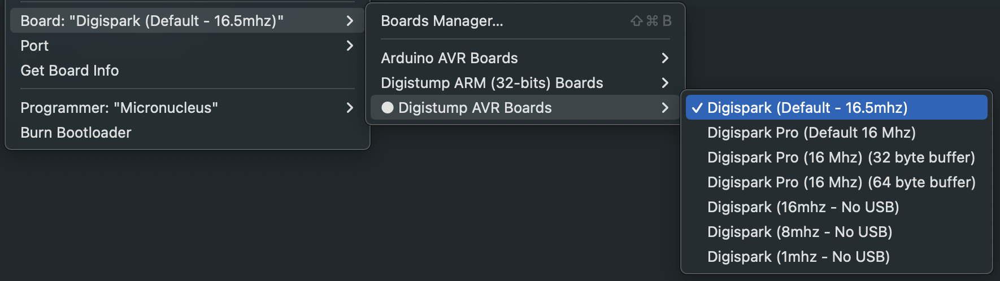

- go to *Tools > Programmer* and select *Micronucleus* from the drop-down menu


- go to *Tools > Port* and select the serial port that appears in the drop-down menu

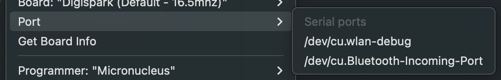

- hit the *Upload* button at the top and wait for the task to complete until Arduino asks to insert the device then plug your device in, let the bootloader compile the code and, once it's done, unplug your device. Yet another advice: on Mac, you can use the command `system_profiler SPUSBDataType` to check that the system recognizes the device 

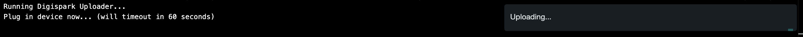
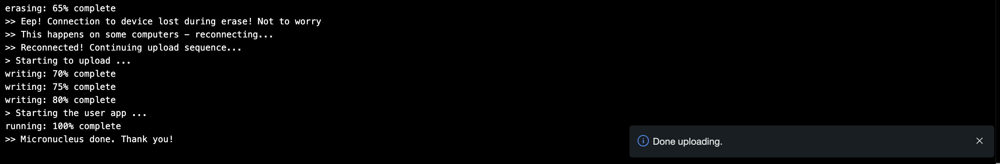

- hover over the desktop and connect the DigiSpark ATTiny85. Done!

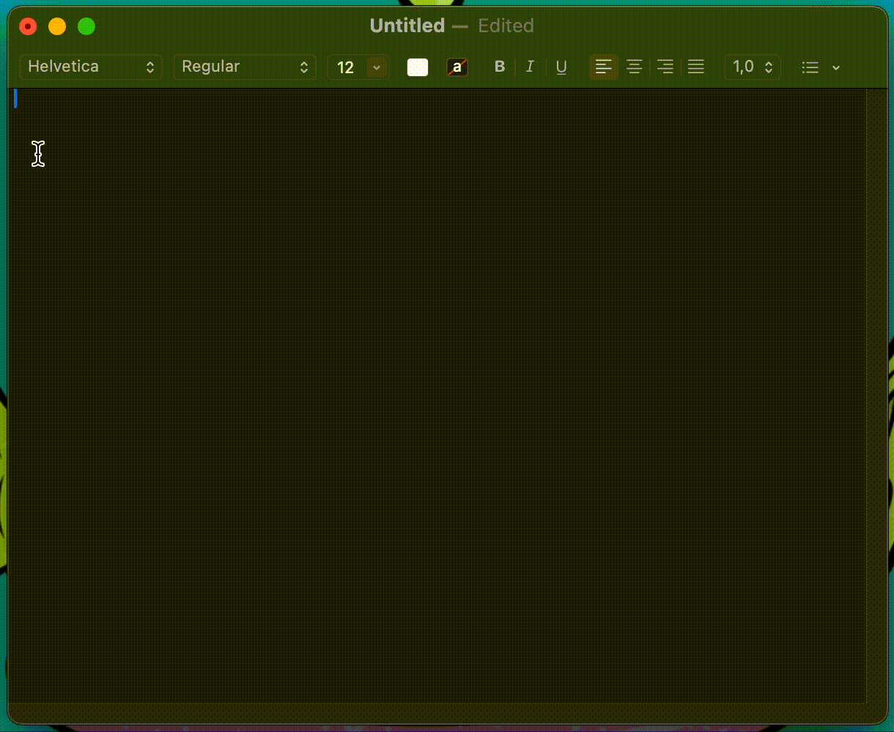

# Documentation

Read the library's [source code](https://github.com/digistump/DigistumpArduino/blob/master/digistump-avr/libraries/DigisparkKeyboard/DigiKeyboard.h) to learn more about functions and constants.