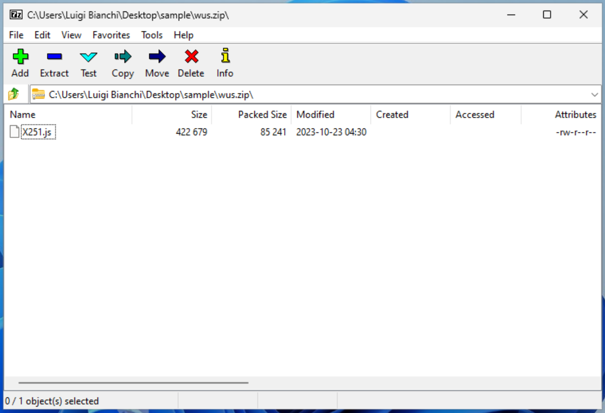
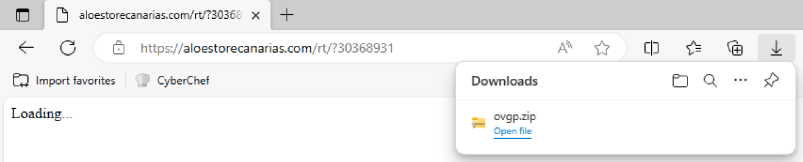
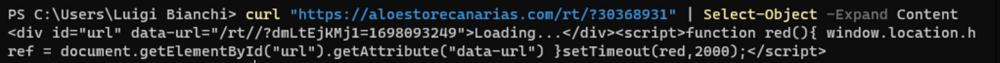
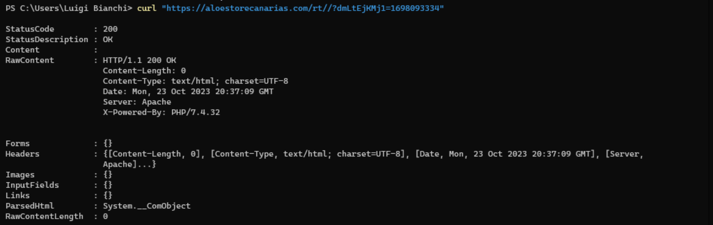
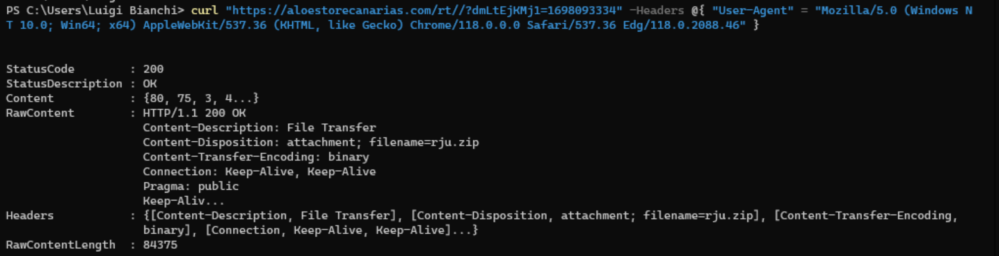
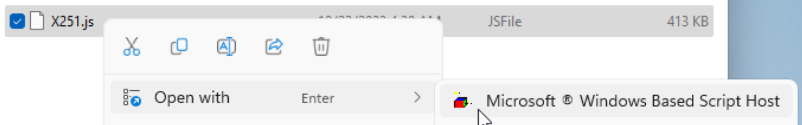
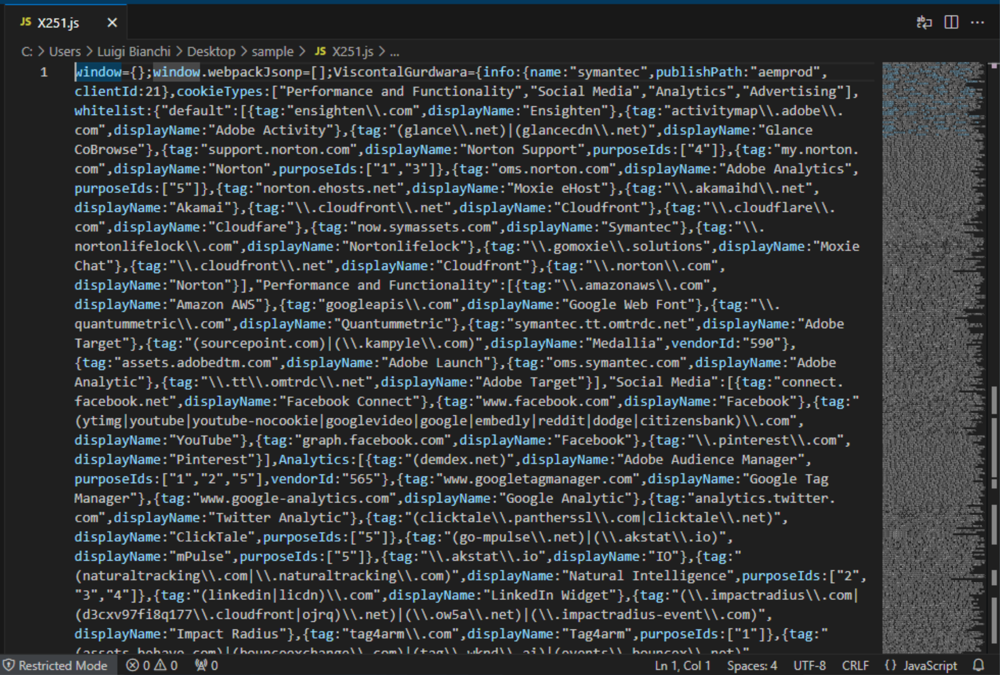
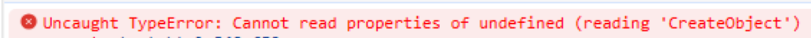
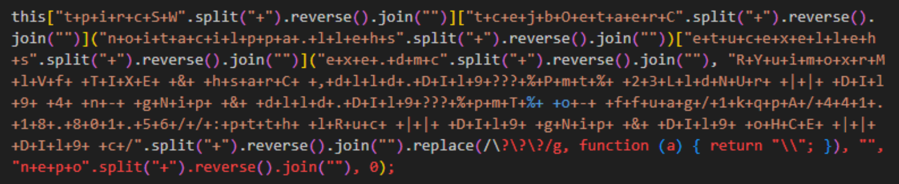
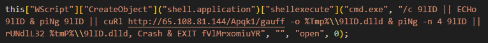

+++
title = 'Click me to the moon: counterfeit invoice archive contains JavaScript dropper and leads to host compromise'
date = 2023-10-26T22:03:53+02:00
draft = false
+++

# Introduction

During my daily blue-team operations I stumbled across a lightning fast infection chain, all started with a suspicious attachment received via e-mail through a compromised supplier address. Since the installed security solution blocked only the first stage payload, I took charge of the alerts and decided to deep dive and analyze the sample.

# Analysis

The initial access vector is a .zip archive, downloaded from the web, containing the following files:

Talking with the victim user reveals that the file was downloaded via a link contained in an e-mail received from a supplier with reference to an urgent invoice to be paid, an usual business e-mail compromise scenario. I wasn't able to identify the original message but I recovered and, of course, navigated the link.

The address points to a fake loading screen which waits for two seconds and redirects to the download. Oddly, doing the same thing via command line is unsuccesful at first try, the redirect returns an empty response in place of the archive; a clever trick to keep the curious away but spoofing the user agent is sufficient with bypass the restriction.

In non-hardened Windows configurations the default program associated with `.js` (and many other extensions associated with interpreted programming languages) is Microsoft Windows based script host or `wscript.exe` for short; combine this with the fact that users tend to double-click on anything and you'll have an initial access.

A quick look at the script shows an incomprehensible chunk of more than a thousand lines of code:

with many references to cookies, analytics and tracking services, which supposes that's the source of an ad-blocker or some kind of browser extension. A not-so-elegant way to figure out where the malicious code is hidden is to embed the script into a blank `.html` file and open it with the browser.

The error points to an interesting piece of code:

which, using CyberChef or similar tools, can be easily deobfuscated by splitting, reversing, joining and replacing the strings within the rounded or square bracket pairs:

Some findings:

- a shell is created using COM objects
- a dynamic linked library named `9lID.dlld` is downloaded to the user's temporary directory and the export function `Crash` is executed via `rundll32.exe` then the interpreter exits
- the `9lID` variable referenced in echo and ping is not defined but since the commands are piped (`||`) the right foremost is executed even if the left foremost fails. It's not clear whether the use of the same name for the variable and the file will prevent the infection from starting again

At the time of the analysis, unfortunately, the hosting infrastructure was already offline so I couldn't retrieve further stages.

# Conclusion

As e-mails remain the go-to solution amoung users as an easy way to share files with colleagues and suppliers, attackers will continue to compromise trusted and ofter less secured suppliers accounts, leveraging trust to trick users into clicking on stuff.

# IOCs

Available [here](iocs.csv).