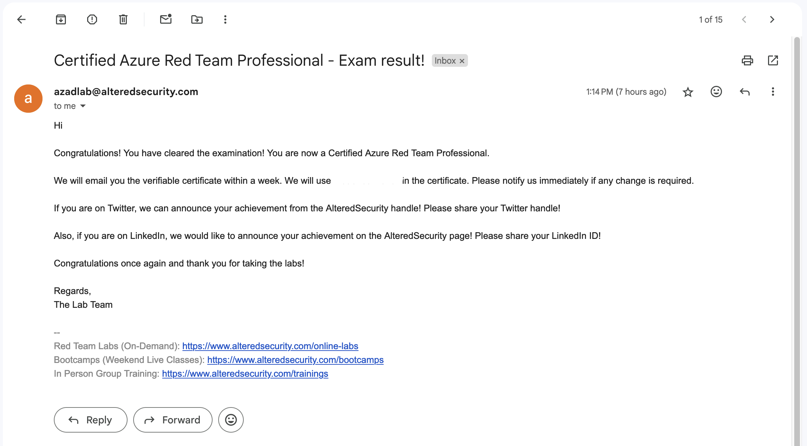

+++
title = "Certified Azure Red Team Professional (CARTP) review"
date = 2024-11-25T20:44:53+02:00
draft = false
categories = ["Red Team"]
tags = ["Azure"]
+++

# Introduction

[Certified Azure Red Team Professional](https://www.alteredsecurity.com/azureadlab) (CARTP) is Altered Security's offering for aspiring red teamers in the Azure environment. With no need for prior subject wisdom, it offers an overview of tactics, techniques and procedures used within the Microsoft cloud. In this review I'll share, based on my experience, the pros and cons of certification, along with some tips and tricks discovered during the course.

# Course

- the topics covered are many, from Azure Active Directory to the most common Azure resources used in enterprise environments and every topic is covered in a stand-alone video with some having a learning objective (twenty-six in total but a few are instructor only) at the end
- $449 ($359 during Black Friday sales) is an attractive price, both for individuals and companies interested in skilling their employees. It includes life-time access to the course material (slides, videos, walk-throughs, etc.) plus one month of lab access and one exam attempt
- I had some technical issues during the lab (especially with the users' simulation scripts e.g. illicit consent grant) but the support, both on Discord or via e-mail, quickly solved every problem even considering the time zone difference (it's based in India) they sometimes answered outside working hours. Also, in case of scheduled maintenance they extended the lab duration 
- I would appreciate a greater focus on the part of mitigations to put in place to prevent a vulnerability, queries to detect a specific pattern or built-in security solutions (since, from my experience, there are a lot) that the cloud provider makes available to protect its work-loads, in order to convey a more holistic approach
- as a working student, 30 days of lab access feels a bit tight to complete all the learning objects and the additional CTF, especially if you need to repeat some lessons or you lose time on some topics, maybe due to technical problems. However, subject to a non-cheap increase, it is possible to extend the duration of the lab up to three months
- is perhaps the most recognized and popular certification in the Azure red team panorama although Altered Security is not as recognized as other providers in the market e.g. Offensive Security

# Exam

The exam consists of a 24 hours non-proctored hands-on assessment (plus an extra hours to make up for the time lost due to the setup of the environment) whose goal is to compromise all resources (including users and applications) and obtain the final flag. In addition, you're provided with a blank  virtual machine (where you can upload any tool of choice) to access the environment. If you've followed each lesson and completed each learning objective, you should have no problem owning all the resources. After that you've 48 hours to submit the final report and, if passed, you'll receive the digital certificate via e-mail within one working week.

# Tips & Tricks

- even if no previous knowledge is required, I recommend to get AZ-900 certified and a minimum confidence with PowerShell scripting, since most of the tools you'll use during the training are writting in PowerShell
- get confident with [Microsoft's documentation](https://learn.microsoft.com/en-us/docs/) since I'll need it a lot during the course
- take notes throughout the course, copy and paste command-lines and save your terminal history from time to time. Same thing during the exam
- prepare the exam report template before. If it's the first time writing an assessment report, take a look at [this article from Hack The Box](https://www.hackthebox.com/blog/penetration-testing-reports-template-and-guide), you can use [Obsidian](https://obsidian.md/) or any other note-taking tool to write the report just make sure it can export in .PDF format since it's the only format allowed for submission
- I used [Remote Desktop client for MacOS](https://itunes.apple.com/app/microsoft-remote-desktop/id1295203466) to connect to the exam virtual machine and the experience was smooth as pie. The binary it's available for free download without account via Microsoft's app center

# Conclusion

Overall, the course provides great value for money, especially considering (even from a career growth perspective) that cloud security is on the rise and cloud-focused offensive training is scarce. The obvious next step is to get [Certified Azure Red Team Expert](https://www.alteredsecurity.com/azureadvanced) (CARTE).